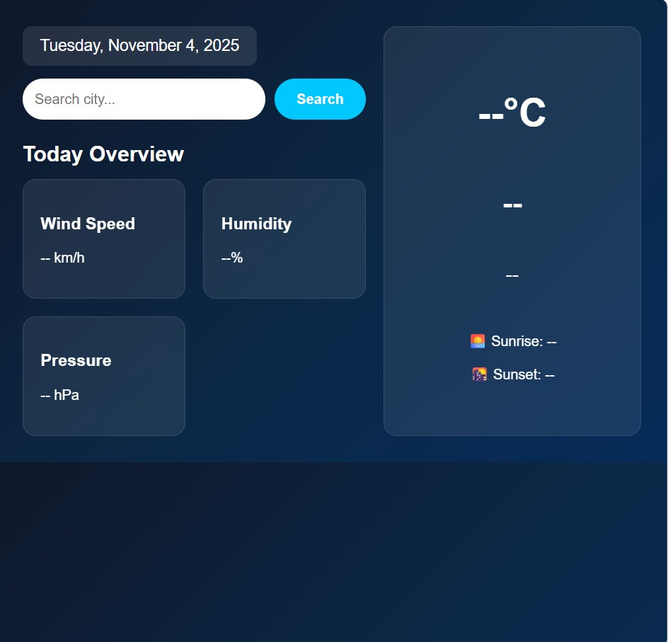
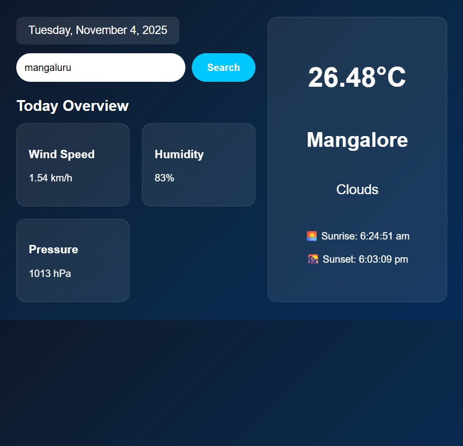

## ☀️ Live Weather App

A simple and beautiful **real-time weather forecasting web application**.
Enter any city name to get live **temperature, humidity, wind speed, and weather conditions** — powered by **OpenWeather API**.

---

### 🚀 Live Demo

🔗 **Visit Website:** [https://ayshamahshoofa.github.io/LiveWeather/](https://ayshamahshoofa.github.io/LiveWeather/)

---
## 📸 Screenshots

<p align="center">
  
  
  
</p>

---

## 🌟 Features

✅ Real-time weather data
✅ Search weather by city name
✅ Displays temperature, humidity, wind & speed
✅ Clean and modern UI
✅ Fully responsive

---

## 🛠️ Tech Stack

| Technology              | Purpose               |
| ----------------------- | --------------------- |
| HTML5                   | Structure             |
| CSS                     | Styling & layout      |
| JavaScript              | App logic & API calls |
| OpenWeatherMap API      | Weather data source   |

---

## 🧠 How It Works

1. User enters a city name
2. App sends a request to **OpenWeather API**
3. API returns real-time weather data
4. Data is displayed on the screen with beautiful UI

---

## 📂 Project Structure

```
📦 LiveWeather
 ┣ 📜 index.html
 ┣ 📜 style.css
 ┣ 📜 script.js
 ┗ 📜 README.md
```

---

## 🚀 Setup Instructions

1️⃣ Clone the repository

```bash
git clone https://github.com/Ayshamahshoofa/LiveWeather.git
```

2️⃣ Open `index.html` in your browser
✔️ No installation needed

---
